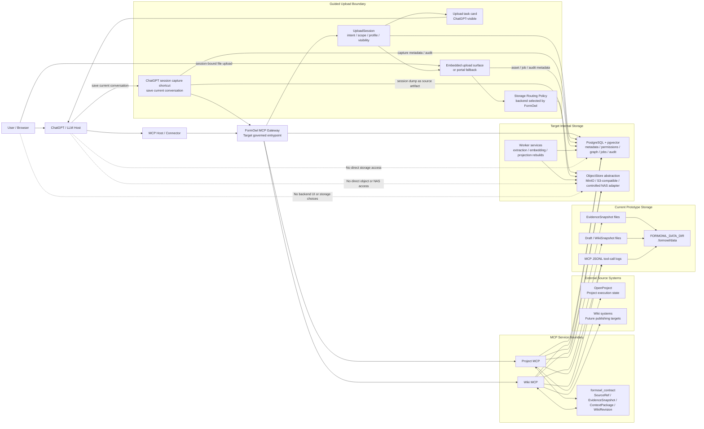
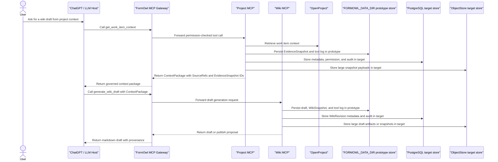

# Architecture

<!-- Future agents: continue building the system architecture documentation in this file. Do not create another architecture document unless SPEC.md is updated first. -->

FormOwl uses a container-first architecture and a graph-governed knowledge pipeline.

The canonical development, test, and deployment environment is a container. Host-installed runtimes are optional conveniences, not required assumptions.

## Implementation Ownership

FormOwl development is split between the Knowledge Graph Research Agent and the
FormOwl System Backbone Agent. The durable role definition, current session
assignment, ownership boundaries, and handoff rules live in
`docs/agent-roles.md`.

Architecture changes should preserve that split: graph and ontology research
work defines source-preserving KG behavior and research evidence, while system
backbone work provides safe service, storage, transport, and runtime boundaries
for that research layer.

The central identity rule is:

```text
Physical storage may be distributed.
Knowledge identity must be centralized.
```

## ChatGPT to Storage Boundary

ChatGPT does not connect to FormOwl storage directly. ChatGPT reaches FormOwl through MCP tools, and those tools call governed FormOwl services. Storage backends remain internal-only.

The current prototype uses file-backed stores under `FORMOWL_DATA_DIR`, defaulting to `.formowl/data`. The target deployment keeps the same logical boundaries while moving metadata, governance, graph state, jobs, and audit to PostgreSQL, and raw or large payloads to an object-store abstraction such as MinIO or another S3-compatible backend.

The user-facing architecture should minimize interface switching. ChatGPT remains the primary task surface, with structured task cards, inline actions, or embedded FormOwl widgets. Any Phase 0 upload page is a session-bound continuation of the current task, not a backend console or storage browser.



### Project Context to Wiki Draft Flow



Raw bytes may live on multiple internal storage backends, including Synology volumes, NAS shares, S3-compatible object storage, MinIO, or controlled ingress folders. Any file that participates in extraction, graph construction, search, or wiki projection must first be registered in the central FormOwl asset catalog. The knowledge graph references stable FormOwl identifiers, not raw storage paths.

## Target Knowledge Pipeline

```text
Raw Resources
  -> Resource Extraction Layer
  -> Observation Store
  -> Candidate Graph
  -> Governed Canonical Graph
  -> User Knowledge Graph
  -> Wiki Projection Layer
  -> WikiRevision
```

Raw resources include project system records, wiki pages, ChatGPT conversations, markdown, PDFs, office documents, images, audio, video, screenshots, and other captured files.

The pipeline rule is strict: raw resources do not directly become final wiki pages. They first become observations and semantic metadata, then candidate graph objects, then governed canonical graph state, then user-specific graph views, and only then projected wiki revisions.

## Governance Layer

Governance crosses every stage of the pipeline.

Policy objects should include:

```text
ExtractionPolicy
AtomGranularityPolicy
OntologyPolicy
EntityResolutionPolicy
RelationResolutionPolicy
LifecyclePolicy
UserGraphAssemblyPolicy
WikiProjectionPolicy
```

The current contract layer includes versioned policy records for extraction,
atom granularity, entity resolution, relation resolution, lifecycle, and wiki
projection. Ontology policy and user graph assembly policy remain separate
future slices so type governance and user graph assembly stay decoupled.

External extractors and LLM graph tools may create observations, candidate atoms, candidate relations, or external graph imports. They must not directly mutate canonical graph state.

## Store Boundaries

```text
AssetStore -> raw resource metadata
ObjectStore -> raw binary files
ObservationStore -> extracted observations
CandidateAtomStore -> uncommitted candidate atoms and relations
CanonicalGraphStore -> canonical atoms, entities, relations, lifecycle events, and graph revisions
UserGraphStore -> user-specific graph revisions
WikiStore -> wiki drafts, revisions, snapshots, and publish proposals
VectorStore -> embeddings for similarity search
JobStore -> ingestion and extraction job status
```

Project MCP and Wiki MCP are current service boundaries inside this larger architecture. Future ingestion and graph services should share contracts with them instead of depending on their internals.

## Internal Storage and Deployment Boundary

The first deployment target is an internal company or lab environment. Raw data should remain inside the trusted network. Synology NAS, PostgreSQL, MinIO or other object storage, worker scratch directories, and raw file paths must not be exposed directly to ChatGPT or the public internet.

PostgreSQL is the source of truth for metadata, governance, job state, permissions, audit, and graph state. It should run on local SSD, NVMe, or reliable block storage, not ordinary NAS or NFS-mounted storage. NAS and object storage are appropriate for raw files, large derived artifacts, backups, snapshots, and retention.

Workers should process registered assets by `asset_id` and `object_uri`. Large files should be copied to local scratch before parsing. Worker scheduling may be storage-aware, but storage locality is a performance concern; it must not fragment knowledge identity.

## Identity and Collaborative Graphs

The sole connected human identity path for the internal closed beta is the
public HTTPS FormOwl `/mcp` resource through FormOwl OAuth 2.1, PKCE S256, and
Google OIDC. Google authenticates the human, while FormOwl remains the
authority for users, invitations, memberships, OAuth clients and token
sessions, workspaces, grants, revocation, and audit. Google tokens are never
accepted as FormOwl MCP bearer tokens.

The connected runtime uses the official MCP SDK's stateless Streamable HTTP
transport on exact `/mcp`. Every protected tool call reloads current
PostgreSQL authorization state and builds a fresh gateway-controlled
`ActorContext`. Caller-supplied actor, workspace, session, membership, and
grant fields cannot replace that authority.

Manual trusted actor selection, JSON-line commands, the hand-built JSON-RPC
runner, and stdio identity variables are test/local compatibility surfaces
only, not connected deployment modes.

Cross-user graph collaboration should use permissioned overlays and grants. Another user's private graph must not be silently merged into the requester graph. Shared answers, graph snippets, evidence snippets, and raw asset access should each have explicit scope, provenance, and audit records.

## Language Boundary

Python is the implementation language for Phase 0. It owns MCP orchestration, adapters, workflow glue, review flows, test fixtures, hashing helpers, diff helpers, validation glue, and day-to-day debugging.

Additional runtime languages must not be introduced unless a concrete parser, validator, large-data transform, or safety boundary requires them and `SPEC.md` is updated first.

## Syntax Shielding

When Python code would require unusual metaprogramming, deeply nested decorators, generated code, fragile regular expressions, complex DSLs, or unsafe dynamic evaluation, the complexity belongs behind a clear Python API boundary. A systems-language backend can be introduced later only with a concrete need and a specification update.
