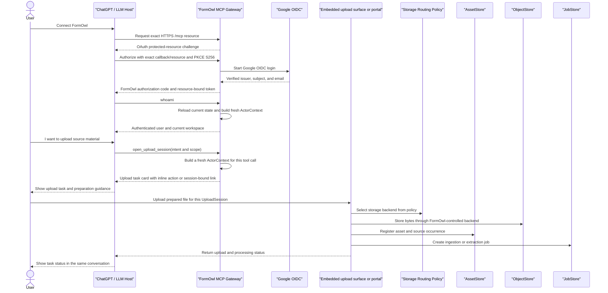

# Workflows

<!-- Future agents: continue building workflow documentation in this file. Do not create another workflow document unless SPEC.md is updated first. -->

FormOwl workflows must be natural-language-first and usable by non-technical project, administrative, and process owners.

Technical systems such as Git, object storage, schema validation, source hashes, and external wiki revision APIs may support the workflow, but they must not be required concepts in the normal user interface.

The preferred user experience is a single conversational task surface. Users
should stay in ChatGPT or an embedded FormOwl task surface whenever possible.
If a deployment requires a separate upload page, that page is a narrow
continuation of the current task, not a backend console, storage browser, or
generic file manager.

Hiding backend operations is both a usability rule and a safety rule. The fewer backend controls exposed to the user, the less likely the system is to receive unstable paths, wrong storage choices, mismatched parser settings, accidental permission leaks, or unaudited source files.

Engineering workflows should also preserve readability. Python is the first debugging layer for MCP behavior, hashing helpers, diff helpers, validation glue, and service orchestration.

The target workflow is pipeline-first:

```text
Raw resource
  -> Observation
  -> Candidate graph
  -> Governed canonical graph
  -> User knowledge graph
  -> Wiki projection
```

Users should experience this as task-oriented review work, not as manual graph maintenance.

## Minimal Local Ingestion Workflow

The current Slice 1 workflow is a deterministic internal path for trusted local
tests. It proves the resource extraction spine before real upload sessions,
workers, OCR, audio, video, graph fusion, or external storage adapters exist.

```text
trusted local file or text payload
  -> register_asset_from_local_file
  -> FileObjectStore copy under a registered local backend
  -> AssetStore record with FormOwl object locator, hash, source ref, and permission scope
  -> create_ingestion_job
  -> run_ingestion_job
  -> PlainTextObservationExtractor
  -> ExtractorRunStore and ObservationStore records
  -> build_context_package_from_text_observations
  -> existing Wiki MCP generate_wiki_draft
```

This path is intentionally narrow:

- It supports deterministic plain text and markdown extraction only.
- It uses FormOwl locators such as `formowl://object/...` in records and does not expose raw local paths through generated context or wiki drafts.
- It creates observations and citation locators with asset, extractor run, and observation IDs.
- It does not create semantic metadata, candidate atoms, canonical graph records, user graph revisions, or wiki revisions.
- Failed local extractor runs leave the ingestion job in `failed` status with an error and without observation records.

## Connected Sign-In and ActorContext Journey

For a connected closed-beta user, FormOwl sign-in is a normal account-linking
journey rather than an identity-selection form:

```text
An owner or authorized operator creates a time-limited FormOwl invitation
  -> the user chooses Connect in ChatGPT
  -> ChatGPT follows the FormOwl OAuth challenge for the exact public HTTPS /mcp resource
  -> FormOwl validates the predefined client, exact callback/resource, and PKCE S256
  -> FormOwl sends the user to Google OIDC
  -> Google returns a verified issuer, subject, and email to FormOwl
  -> FormOwl matches the invitation and binds (issuer, subject) to a FormOwl user
  -> FormOwl issues its own fixed-3600-second, resource-bound access token
  -> ChatGPT calls whoami and governed tools through /mcp
```

The predefined client ID is a stable non-secret value selected and recorded by
the deployment operator before discovery. ChatGPT app management must use that
same value if its current predefined-client UI supports entry or selection; if
it does not, the live flow stops as an external blocker. ChatGPT supplies and
displays only the exact production callback
`https://chatgpt.com/connector/oauth/{callback_id}`. The ID must never be
invented or described as generated/displayed by ChatGPT. The current
closed-beta flow remains a predefined-client design; it does not claim a CIMD
migration or DCR fallback.

Google tokens are never used as FormOwl MCP bearer tokens. On every protected
tool call, the gateway reloads the token session, user, external identity,
client authorization, current workspace membership, and active grants from
PostgreSQL, then creates a fresh `ActorContext`. A tool argument cannot select
or replace the actor, workspace, session, membership, or grant.

The first owner starts from an operator-authorized bootstrap invitation for an
otherwise empty workspace; no placeholder user is created. After that owner
completes a real Google login, the owner may invite a second user. The second
user follows the same Google-backed flow and receives only the invited role and
workspace.

Failure and recovery behavior is intentionally visible and safe:

```text
expired, missing, or email-mismatched invitation -> no user, membership, code, or token is created
disabled user or external identity -> protected calls are denied
revoked client authorization or token session -> the existing token is denied immediately
removed workspace membership -> a newly resolved ActorContext cannot use that workspace
expired token after trusted UTC is strictly later than expires_at plus the fixed 30-second skew -> the user must reconnect through the full FormOwl and Google flow
successful relink -> a new token session is created; the revoked or expired session stays unusable
```

Allowed and denied decisions are audited with user or unauthenticated actor,
external identity, OAuth client, token session, request, tool call, workspace
when proven, target, reason code, and timestamp. Raw bearer tokens,
authorization codes, PKCE verifiers, Google tokens, and secrets never enter
audit records or public errors.

`ManualTrustedInternalAuthProvider`, JSON-line commands, the hand-built
JSON-RPC runner, and stdio identity environment variables remain test/local
compatibility tools only. They are not connected sign-in or ChatGPT
configuration paths.

## Issue #20 Completion Boundary

Issue #20 owns the Google-backed FormOwl OAuth bridge and the fresh
gateway-controlled `ActorContext` used by connected tools. Repository tests do
not replace the required fresh PostgreSQL, restart-persistence, first-owner,
second-user, revocation/relink, signing-key rotation, remote MCP Inspector, and
real ChatGPT plus Google journeys. Issue #20 remains open until those external
gates and the configured reviewer gate are accepted; this workflow makes no
production-readiness claim.

Generic Asset governance and source-specific ingestion remain outside this
Issue #20 completion boundary and do not define an alternate connected identity
flow, manual actor-selection path, or ChatGPT transport.

## Guided Upload and Source Preparation Flow

FormOwl users normally interact with the system through ChatGPT and the FormOwl MCP server. Users must not be required to switch into backend tools or manually choose NAS folders, storage backends, buckets, volumes, queues, parser-specific paths, or extractor settings during normal usage.

All user-initiated uploads must begin with an `UploadSession`. The session captures intent before file transfer begins:

```text
authenticated actor
owner scope
workspace scope
project scope
customer scope
intended asset type
ingestion profile
visibility scope
upload expiration
source preparation state
processing status
```

The current file-backed `UploadSessionStore` and `create_upload_session()` helper
enforce that normal upload sessions include intent, actor identity, permission
scope, and a linked audit log before the session is persisted.

Controlled backend imports use `upload_asset_reference()`. This helper is
reserved for migrations, trusted backend references, and other controlled import
paths; it still registers an `Asset`, records permission scope, requires source
provenance and an import reason, and writes audit records. It is not the normal
user upload path.

The physical storage backend is selected by FormOwl according to storage routing policy. Users see the business and knowledge scope of the upload, not the physical storage placement.

### Upload UX

FormOwl should provide a task-oriented upload experience that keeps the user inside the current conversational workflow as much as possible.

In Phase 0, the MCP server may return a structured upload task card and an internal FormOwl upload surface link. In later phases, the upload task should be represented as an embedded ChatGPT app or widget. The link or widget is not a separate backend interface; it is a session-bound continuation of the current task.

The upload card should show:

```text
upload session ID
authenticated actor
owner scope
workspace / project / customer scope
asset type
ingestion profile
visibility scope
status
inline upload action or session-bound upload link
```

The upload surface must not behave as a generic file manager. It must be bound to a single `UploadSession` and should only allow files compatible with the declared ingestion profile.

### Source Preparation Guidance

Some source artifacts require user preparation before upload. For example, mail ingestion may require the user to export a PST, OST, MSG, or EML file from an email client.

When a user wants to upload data but does not know how to produce the required source artifact, FormOwl should guide the user through a source-specific preparation flow.

For mail ingestion, FormOwl should support guided PST preparation. The assistant may ask which mail client or account type the user is using, then provide step-by-step instructions. The guidance must remain attached to the `UploadSession` so the exported file has a known owner, scope, ingestion profile, and visibility policy before upload.

The assistant must not give generic instructions that leave the user with an untracked local file and no corresponding FormOwl upload task.

For #21 Phase 1, ordinary users should not be required to install a Local
Companion, split PST files, choose a NAS or object-store location, or run local
dedup/preprocessing. The baseline mail path is a full PST upload through a
session-bound FormOwl upload surface / iframe. Local Companion remains an
optional or policy-triggered advanced path for rolling repeated PST imports,
privacy-sensitive imports, bandwidth-limited sites, or manifest-first workspace
policy.

### Required Principle

```text
Source preparation produces a file.
UploadSession determines where and how that file enters FormOwl.
Storage routing, parser execution, asset registration, and graph integration are handled by FormOwl, not by the user.
```

### Phase 1 Mail Archive Upload

The Phase 1 mail evidence path is:

```text
UploadSession
  -> session-bound PST upload surface / iframe
  -> ingest staging
  -> server-side incremental parser worker
  -> MailEvidenceBundle
  -> PostgreSQL normalized mail evidence
  -> governed MCP evidence query
```

The raw PST is an import carrier, not permanent default evidence storage. After
successful extraction, FormOwl should delete it or retain it only under a short
configured retention / legal-audit policy. PostgreSQL stores normalized mail
evidence, parse runs, warnings, fingerprints, and occurrence lineage; raw PST
and attachment bytes stay in ObjectStore / staging / retention-controlled
storage.

The optional Local Companion path must emit the same `MailEvidenceBundle` as
the server-side parser. It may optimize repeated rolling PST imports or
manifest-first privacy workflows, but it must not create a second mail evidence
model.

The current internal checkpoint for this path is a synthetic
UploadSession-bound import helper: an existing mail `UploadSession` is validated
before side effects, the staged archive is registered as an `Asset`, an
`IngestionJob` runs through `FixtureMailArchiveExtractor`, a server-side
`MailEvidenceBundle` with `upload_session_id` is written through the PostgreSQL
mail evidence store contract, and a store-backed local JSON-RPC compatibility
`query_mail_evidence` owner query is verified. This is still not a real PST parser, upload UI /
iframe, live PostgreSQL readiness, production worker leasing, KG write, wiki
projection, or production readiness claim.

The current governed `open_upload_session` handler can return a session-bound
mail upload task card. The card uses a
`formowl_upload_session:<upload_id>` public locator, attaches mail archive
source-preparation guidance, accepts PST/OST/MSG/EML/MBOX profiles, and creates
an audited `UploadSession` without exposing storage backends, parser controls,
worker queues, raw paths, SQL-like values, or object-store internals. The
connected runtime may expose this handler only after OAuth and fresh
`ActorContext` resolution. This is only the task/session entrypoint for a later
upload surface; it is not the real iframe implementation, real mail parser,
live PostgreSQL readiness, production worker leasing, ChatGPT smoke completion,
or production readiness claim.

The local compatibility command for this handler is
`formowl-semantic-mcp-jsonrpc`. Its preflight launches the command as a
subprocess, performs JSON-RPC `initialize`, `tools/list`, and
`tools/call open_upload_session`, verifies the returned upload task card, and
checks that the task-card upload id and locator resolve to the persisted
`UploadSession`. This tests the handler contract only. It is not the formal
ChatGPT connection, does not use FormOwl OAuth or Google OIDC, and does not
perform file transfer, upload iframe handling, or mail parsing.

The current backend upload-intake checkpoint adds
`formowl_mail.receive_mail_archive_upload()`. A trusted server upload surface
can pass a server-staged PST/OST/MSG/EML/MBOX upload to this helper with the
existing `UploadSession`, actor, and MCP session identity. The helper rejects
mismatched sessions, unsupported filenames, content-hash mismatch, and
user-supplied infrastructure-control form fields before side effects; registers
the upload as a governed `Asset` and ObjectStore payload; writes asset and
upload-receipt audit events; binds `UploadSession.asset_id`; reuses duplicate
object payloads for repeated rolling exports; and returns only a
hash/status/count public receipt. This is backend file-transfer receipt only:
it is not the actual iframe UI, actual ChatGPT connected upload, real mail
parser, live PostgreSQL readiness, production worker leasing, KG write, wiki
projection, or production readiness.

The current local HTTP upload-surface contract checkpoint adds
`formowl_mail.create_mail_upload_http_surface_server()` and
`formowl_mail.receive_mail_archive_http_multipart()`. The harness uses only the
Python standard library HTTP server and multipart parser path in tests. `GET
/mail/upload/<upload_session_id>` renders a single-session mail archive form,
and `POST /mail/upload/<upload_session_id>` accepts one multipart
`mail_archive` file plus session-bound public fields, writes a temporary
server-staged body, calls the backend upload-intake helper, removes the
temporary staged body after intake, and returns a safe JSON receipt. The
surface rejects missing or mismatched session fields, unsupported filenames,
malformed multipart bodies, oversized requests, wrong actor/session/status, and
user-supplied storage/parser/worker fields before durable side effects. This is
a local HTTP contract harness for the future iframe/portal integration; it is
not an actual ChatGPT connected upload, production iframe, real mail parser,
live PostgreSQL deployment, production worker leasing, KG write, wiki
projection, or production readiness claim.

The current MCP-command-to-local-HTTP compatibility smoke connects those two
local surfaces without claiming production integration. It launches the
`formowl-semantic-mcp-jsonrpc` command, opens a mail upload task through
JSON-RPC `open_upload_session`, resolves the persisted `UploadSession`, starts
the local HTTP upload surface with the same trusted session identity and
stores, posts synthetic multipart PST bytes to
`/mail/upload/<upload_session_id>`, and verifies that the session is bound to a
governed `Asset`, ObjectStore payload, and upload audit trail while temporary
staging is cleaned. Negative probes cover wrong route/session/workspace,
user-supplied infrastructure controls, duplicate multipart files, malformed
multipart, oversized bodies, and safe startup/surface errors with no durable
side effects. This is still a local contract smoke only; actual ChatGPT
connected upload, production iframe readiness, real mail parsing, live
PostgreSQL deployment, production worker leasing, KG write, wiki projection,
and production readiness remain open.

The current local upload-to-import-and-query smoke extends that contract one
step closer to the Phase 1 evidence path. It opens a mail upload task through
the local compatibility command, uploads a synthetic JSON-backed mail fixture through
the local HTTP surface using the same `UploadSession`, runs
`run_upload_session_mail_import()` against the asset already bound by the upload
surface, writes normalized mail evidence through the PostgreSQL adapter
contract, and verifies store-backed JSON-RPC `query_mail_evidence` owner and
denied paths. It also probes missing asset, wrong asset source ref, parser
failure, evidence-store failure, and query failure behavior without marking the
session successful. This remains a local synthetic smoke only; actual ChatGPT
connected upload, production iframe readiness, real PST/OST/MSG/EML/MBOX
parsing, live PostgreSQL deployment, production worker leasing, KG write, wiki
projection, and production readiness remain open.

The historical connection preflight packages that local command as a bounded
stdio compatibility attachment. It publishes only hashes, statuses, and counts
for required environment names, tools, JSON-RPC sequence, task-card shape, and
session shape, while rejecting concrete values, locators, raw command paths,
and connected-flow claims. It must not be used to configure the formal
connected service, which requires public HTTPS `/mcp`, FormOwl OAuth, Google
OIDC, and server-resolved `ActorContext`.

The matching historical result-intake helper validates a bounded
operator-supplied compatibility packet after `open_upload_session`. It rejects
environment values, concrete upload locators, mail payload fields, raw command
paths, static-contract hash tampering, and claims that file transfer or a
connected production-shaped path has been proven. This is regression evidence
for the compatibility facade only; it is not live ChatGPT, OAuth, file-transfer,
production iframe, real parser, live PostgreSQL, or #21 completion evidence.

The scoped #21 local Phase 1 Mail Evidence Reading proof is complete for
synthetic evidence and local compatibility testing. The governed JSON-RPC
surface supports `query_mail_evidence` and `answer_mail_case_progress` over
normalized `MailEvidenceBundle` records, with owner/denied/forged-grant/
trusted-grant and bundle-id probes in the ChatGPT-free smoke. Case-progress
answers preserve citations to mail observations, denied and not-found paths
return no evidence content, JSON-RPC transcripts stay hash-only, and public
reports carry only hashes, statuses, counts, and explicit false claim
boundaries. This completion does not claim actual ChatGPT connected upload or
file transfer, production iframe readiness, real PST/OST/MSG/EML/MBOX parser
readiness, live PostgreSQL deployment readiness, production worker leasing,
KG write, wiki projection, or production readiness.

The historical mail-evidence result-intake checkpoint is the bounded return
path for a manual fixture-backed local compatibility smoke. After the
compatibility client calls `query_mail_evidence` plus
`answer_mail_case_progress` for owner and denied fixture paths,
`scripts/mail_evidence_chatgpt_result_intake.py` validates a
result packet containing only hashes, statuses, counts, fixture-smoke contract
binding, owner citation counts, denied redaction counts, and operator
attestation. The intake rejects raw transcripts, raw tool payloads,
mail body/snippet/text fields, concrete mail identifiers, upload locators,
environment values, paths, SQL, parser/storage/worker internals, bool counts,
duplicate response hashes, static-contract tampering, permission-bypass
claims, KG/wiki claims, and production overclaims. This is operator-supplied
compatibility evidence only; it is not a live ChatGPT or OAuth test,
cryptographic session proof, raw file transfer, raw mail access, production
iframe readiness, real parser readiness, live PostgreSQL readiness, or
production readiness.

The current real PST parser checkpoint proves only a sampled parser path for
the operator-provided `tests/pst-exm/archive.pst` fixture. The dev container
installs `pst-utils`, and `PstMailArchiveExtractor` shells out to `readpst` in
an internal scratch directory, parses exported RFC822 messages, and emits the
same mail observation shapes consumed by `MailEvidenceBundle`. The sampled
smoke then runs:

```text
operator-provided PST fixture
  -> UploadSession
  -> Asset/ObjectStore
  -> IngestionJob
  -> PstMailArchiveExtractor / ExtractorRun
  -> ObservationStore
  -> MailEvidenceBundle
  -> PostgreSQLMailEvidenceStore contract
  -> local JSON-RPC compatibility query_mail_evidence owner and denied probes
```

The public report from `scripts/mail_real_pst_smoke.py` contains only hashes,
statuses, counts, and explicit claim-boundary booleans. It must not expose the
fixture path, parser command line, parser scratch directory, object-store
locator, concrete message id, header, subject, sender, attachment filename,
body/snippet text, SQL, environment value, or traceback. The current sampled
report may claim `supports_real_pst_sampled_parser_claim=true` only after
validation passes. It must keep full-parser, actual ChatGPT upload or file
transfer, production iframe, live PostgreSQL, worker leasing, raw-mail-access,
KG, wiki, and production-readiness claims false. The raw PST ObjectStore asset
is currently recorded as `retained_by_policy` under `retain_7_days`; deletion
after extraction remains a future retention-policy implementation slice.

### Upload Flow



## ChatGPT Session Capture Shortcut

Because ChatGPT is the primary discussion surface, FormOwl should provide a small convenience shortcut for saving the current conversation as a source artifact. This is a frequent workflow shortcut, not a separate ingestion backbone.

The user experience should be:

```text
User: Save this conversation into FormOwl.
ChatGPT -> MCP Gateway: capture_current_chatgpt_session(scope and visibility)
MCP Gateway -> FormOwl backend: create capture record, store session dump, register asset, create ingestion job
ChatGPT: shows a capture task card and processing status
```

The shortcut may avoid a visible upload page because the source artifact is the
current ChatGPT session. It must still record the authenticated actor, current
workspace or project scope, source account metadata, visibility, capture
method, storage locator, asset registration, ingestion job, and audit event.

The current `capture_current_chatgpt_session()` helper follows that path by
rendering the conversation into a source artifact, copying it through the
registered object store, creating an `Asset`, creating an `IngestionJob`, saving
a capture record, and writing audit records. The temporary scratch file remains
inside the selected FormOwl storage backend and is not exposed to MCP callers.

The capture task card should show:

```text
capture ID
authenticated actor
workspace / project / customer scope
visibility scope
source account status
capture method
processing status
```

## Technical Metadata Extraction

The current deterministic metadata adapter is `FileTechnicalMetadataExtractor`.
It runs against registered assets and creates a `technical_metadata` observation
with file size, MIME type, content hash, original filename, source ref, and
FormOwl object locator. It does not call ExifTool, MediaInfo, FFmpeg, OCR, ASR,
LLMs, or graph tooling yet.

## Deterministic Fixture Extractors

The current real-adapter boundary includes deterministic fixture adapters for
document structure, OCR text, audio transcripts, video scenes/keyframes, and
mail archives.
These adapters are deliberately narrow: they prove `ExtractorRun`,
`Observation`, locator metadata, permission scope, and source provenance for each
modality without introducing external parser or model dependencies.

Supported fixture adapters:

- `FixtureDocumentParserExtractor` reads text-backed document fixtures and emits
  heading, paragraph, table, and list-item observations with page and block
  locators.
- `FixtureOcrExtractor` reads text-backed image/PDF OCR fixtures and emits
  `ocr_line` observations with page, image, line, and bounding-box locators.
- `FixtureAudioTranscriptExtractor` reads text-backed transcript fixtures and
  emits `transcript_segment` observations with start/end timestamps and speaker
  locators.
- `FixtureVideoSceneExtractor` reads text-backed video fixtures and emits
  `video_scene` and `keyframe` observations with time, frame, and scene locators.
- `FixtureMailArchiveExtractor` reads JSON-backed mail archive fixtures and
  emits `email_thread`, `email_header`, `email_message`,
  `email_body_segment`, `email_attachment_occurrence`, and
  `mail_folder_occurrence` observations. Archive, mailbox, folder, message,
  thread, body, and attachment occurrence identities remain separate.

These are not replacements for Docling, Tesseract, Whisper, FFmpeg, or
PySceneDetect, nor are they a PST/OST/MSG/EML parser. Later adapters can use
those tools behind the same `ExtractorAdapter` boundary and write to the same
stores.

### FormOwl Mail Evidence Adapter Boundary

The official mail adapter boundary is defined in
`RESOURCE_EXTRACTION_SPEC.md#47-mail-and-pst-ingestion`. Mail parsing starts
only after an upload, trusted folder scan, or controlled import has registered a
mail source as an `Asset` and created an `IngestionJob`. A mail adapter writes
`ExtractorRun` and `Observation` records through the normal stores; it does not
watch mail folders directly, expose parser-local paths, create graph
candidates, answer case-progress questions, publish wiki pages, or mutate
canonical graph state.

The JSON-backed `FixtureMailArchiveExtractor` is the current synthetic
conformance baseline for that boundary. It is enough to prove deterministic
archive/message/occurrence identity and raw-path non-exposure for fixtures. It
still only parses observations; the completed synthetic workflow below adds
separate evidence/search, candidate bridge, case-progress QA, and preflight
helpers for JSON fixtures. This is not a production PST/OST/MSG/EML parser or
real mailbox retrieval/index readiness claim.

The completed synthetic mail workflow is:

```text
JSON mail archive fixture
  -> Asset / IngestionJob
  -> FixtureMailArchiveExtractor
  -> email_thread / email_header / email_message / email_body_segment /
     email_attachment_occurrence / mail_folder_occurrence Observations
  -> MailEvidencePackStore and deterministic mail search index
  -> reviewable SemanticMetadata, CandidateAtom, and CandidateRelation proposals
  -> case-progress answer with observation citations
  -> synthetic-phase preflight readiness artifact
```

This workflow keeps the layers separate. The evidence pack reads persisted
observations and exposes safe snippets; the candidate bridge writes only
proposal records; the case-progress answer is a cited read model; and the
preflight artifact records that real PST/OST/MSG/EML parser readiness remains a
future assignment.

## Candidate Graph Contracts

The current candidate graph layer has contract models for `CandidateAtom`,
`CandidateRelation`, and `ExternalGraphImport`. These records are proposals:
they preserve source observation IDs, optional semantic metadata IDs, extractor
run provenance, confidence, and review status. They do not create canonical graph
state, user graph revisions, wiki revisions, or merge decisions.

The shortcut must not expose raw storage folders, object-store paths, or backend controls. After capture, the session follows the normal pipeline:

```text
ChatGPT session dump
  -> Asset / RawResource
  -> IngestionJob / ExtractorRun
  -> Observations
  -> CandidateGraph
  -> governed graph / wiki projection
```

## Project Context to Wiki Revision

```text
User asks for a wiki update in natural language
  -> Project MCP retrieves source context
  -> Project MCP stores evidence snapshots when needed
  -> Wiki MCP generates or refreshes a draft revision
  -> Wiki MCP shows a human-readable diff and citations
  -> Reviewer approves or requests changes
  -> Wiki MCP records an immutable reviewed revision
  -> Wiki MCP prepares a publish proposal
  -> Publish adapter writes to the target wiki if approved
```

The current backend-specific publish adapter slice implements the proposal
preparation step for OpenProject Wiki. `publish_wiki_page` returns a safe
backend proposal with `publish_mode: proposal_only` and
`external_write_performed: false`; it does not perform the final adapter write.
Automatic publishing must remain off unless a later approved backend
configuration explicitly enables it.

## User-Facing Actions

```text
save draft
submit for review
compare changes
approve
publish
refresh from sources
restore previous version
```

## Hidden Backend Actions

```text
create WikiRevision records
persist raw evidence snapshots
calculate markdown and response hashes
record backend revision IDs
optionally mirror reviewed or published revisions to Git
call Python helper APIs for validation, hashing, diffing, or syntax-shielded logic
```

## Multimodal Resource to Wiki Projection

```text
User asks for a meeting page, project hub update, or decision page from mixed resources
  -> FormOwl registers files, project records, wiki pages, and conversations as assets
  -> FormOwl creates ingestion jobs
  -> Extractors produce observations such as transcript segments, document blocks, OCR spans, scenes, and issue comments
  -> Semantic metadata extraction proposes decisions, action items, risks, entities, relations, topics, and requirements
  -> Candidate graph preview is shown for review
  -> Reviewers approve, reject, split, merge, or defer candidate atoms and relations
  -> Entity and relation resolution commits approved graph changes
  -> User graph assembly selects the role/task-specific view
  -> WikiProjectionSpec generates a draft WikiRevision with citations and graph lineage
  -> Reviewer compares, edits, approves, and publishes through the normal wiki workflow
```

## Candidate Graph Review

```text
preview graph candidates
adjust atom granularity
resolve entity aliases
resolve relation conflicts
commit approved candidates
record lifecycle events
generate or refresh a user graph revision
project a wiki draft from that graph revision
```

External tools and LLMs can help create candidates, but they do not approve canonical graph changes on their own.

## Scope-Aware Graph Fusion

```text
candidate matching proposes same-as or related-to candidates
  -> access overlay decides whether the requester may inspect another scope's graph/evidence/raw data
  -> governance review decides whether a canonical merge should happen inside a target scope
  -> merge decisions record target scope, evidence, approver, conflict notes, and audit events
```

Matching does not grant access. Access does not merge graph state. Canonical merge does not grant raw asset access.

## KG-First Cross-Resource Retrieval

The ChatGPT-facing retrieval path uses the effective graph as the primary
cross-resource integration layer while preserving observations and raw assets
as evidence and source of truth:

```text
query_effective_graph_view
  -> query-score permission-visible graph nodes and edges
  -> resolve graph-hit source_observation_ids
  -> return governed observation snippets and modality locators
  -> evaluate graph confidence and evidence coverage
  -> use vector/metadata fallback only when the graph path is insufficient
  -> emit review-required Candidate KG proposal seeds from fallback evidence
```

The evidence resolver exposes only allowlisted modality location fields and
`formowl://observation/{observation_id}` references. Raw asset references remain
separate and require an explicit asset-scoped grant. Fallback seeds are DTOs for
later candidate extraction/review; the query performs no candidate-store or
canonical-graph write.

The deterministic synthetic conformance fixture is
`scripts/kg_first_cross_resource_smoke.py`. It proves one Optoma quotation
decision can be matched through a candidate graph object and resolved to mail,
slide, and project observations. A second query proves incomplete graph
evidence triggers fallback and produces a review-required seed without a
canonical artifact. This fixture is not real enterprise-data or production
readiness evidence.
