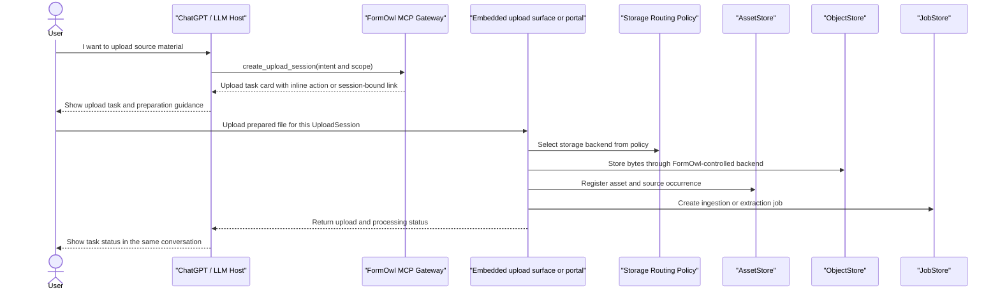

# Workflows

<!-- Future agents: continue building workflow documentation in this file. Do not create another workflow document unless SPEC.md is updated first. -->

FormOwl workflows must be natural-language-first and usable by non-technical project, administrative, and process owners.

Technical systems such as Git, object storage, schema validation, source hashes, and external wiki revision APIs may support the workflow, but they must not be required concepts in the normal user interface.

The preferred user experience is a single conversational task surface. Users should stay in ChatGPT or an embedded FormOwl task surface whenever possible. If Phase 0 requires a separate upload page, that page is a narrow continuation of the current task, not a backend console, storage browser, or generic file manager.

Hiding backend operations is both a usability rule and a safety rule. The fewer backend controls exposed to the user, the less likely the system is to receive unstable paths, wrong storage choices, mismatched parser settings, accidental permission leaks, or unaudited source files.

Engineering workflows should also preserve readability. Python is the first debugging layer for MCP behavior, hashing helpers, diff helpers, validation glue, and service orchestration.

The target workflow is pipeline-first:

```text
Raw resource
  -> Observation
  -> Candidate graph
  -> Governed canonical graph
  -> User knowledge graph
  -> Wiki projection
```

Users should experience this as task-oriented review work, not as manual graph maintenance.

## Minimal Local Ingestion Workflow

The current Slice 1 workflow is a deterministic internal path for trusted local
tests. It proves the resource extraction spine before real upload sessions,
workers, OCR, audio, video, graph fusion, or external storage adapters exist.

```text
trusted local file or text payload
  -> register_asset_from_local_file
  -> FileObjectStore copy under a registered local backend
  -> AssetStore record with FormOwl object locator, hash, source ref, and permission scope
  -> create_ingestion_job
  -> run_ingestion_job
  -> PlainTextObservationExtractor
  -> ExtractorRunStore and ObservationStore records
  -> build_context_package_from_text_observations
  -> existing Wiki MCP generate_wiki_draft
```

This path is intentionally narrow:

- It supports deterministic plain text and markdown extraction only.
- It uses FormOwl locators such as `formowl://object/...` in records and does not expose raw local paths through generated context or wiki drafts.
- It creates observations and citation locators with asset, extractor run, and observation IDs.
- It does not create semantic metadata, candidate atoms, canonical graph records, user graph revisions, or wiki revisions.
- Failed local extractor runs leave the ingestion job in `failed` status with an error and without observation records.

## Phase 0 Identity and Audit Helpers

The current Phase 0 implementation includes `ManualTrustedInternalAuthProvider`
for trusted internal tests. It selects a pre-seeded active `User`, creates a
`SessionIdentity`, and returns actor context with workspace memberships, active
grants, and pending access requests. This provider is explicitly not production
authentication and does not validate SSO, OIDC, passwords, cookies, or external
identity assertions.

File-backed audit logging records reviewable `AuditLog` records for actor
selection, asset registration, ingestion job creation, evidence snapshot fetches,
permission denials, and upload session creation. User-facing gateway flows should
pass actor, session, workspace, target, status, and timestamp fields so these
events remain traceable.

## Guided Upload and Source Preparation Flow

FormOwl users normally interact with the system through ChatGPT and the FormOwl MCP server. Users must not be required to switch into backend tools or manually choose NAS folders, storage backends, buckets, volumes, queues, parser-specific paths, or extractor settings during normal usage.

All user-initiated uploads must begin with an `UploadSession`. The session captures intent before file transfer begins:

```text
selected user
owner scope
workspace scope
project scope
customer scope
intended asset type
ingestion profile
visibility scope
upload expiration
source preparation state
processing status
```

The current file-backed `UploadSessionStore` and `create_upload_session()` helper
enforce that normal upload sessions include intent, actor identity, permission
scope, and a linked audit log before the session is persisted.

Controlled backend imports use `upload_asset_reference()`. This helper is
reserved for migrations, trusted backend references, and other controlled import
paths; it still registers an `Asset`, records permission scope, requires source
provenance and an import reason, and writes audit records. It is not the normal
user upload path.

The physical storage backend is selected by FormOwl according to storage routing policy. Users see the business and knowledge scope of the upload, not the physical storage placement.

### Upload UX

FormOwl should provide a task-oriented upload experience that keeps the user inside the current conversational workflow as much as possible.

In Phase 0, the MCP server may return a structured upload task card and an internal FormOwl upload surface link. In later phases, the upload task should be represented as an embedded ChatGPT app or widget. The link or widget is not a separate backend interface; it is a session-bound continuation of the current task.

The upload card should show:

```text
upload session ID
current user
owner scope
workspace / project / customer scope
asset type
ingestion profile
visibility scope
status
inline upload action or session-bound upload link
```

The upload surface must not behave as a generic file manager. It must be bound to a single `UploadSession` and should only allow files compatible with the declared ingestion profile.

### Source Preparation Guidance

Some source artifacts require user preparation before upload. For example, mail ingestion may require the user to export a PST, OST, MSG, or EML file from an email client.

When a user wants to upload data but does not know how to produce the required source artifact, FormOwl should guide the user through a source-specific preparation flow.

For mail ingestion, FormOwl should support guided PST preparation. The assistant may ask which mail client or account type the user is using, then provide step-by-step instructions. The guidance must remain attached to the `UploadSession` so the exported file has a known owner, scope, ingestion profile, and visibility policy before upload.

The assistant must not give generic instructions that leave the user with an untracked local file and no corresponding FormOwl upload task.

### Required Principle

```text
Source preparation produces a file.
UploadSession determines where and how that file enters FormOwl.
Storage routing, parser execution, asset registration, and graph integration are handled by FormOwl, not by the user.
```

### Upload Flow



## ChatGPT Session Capture Shortcut

Because ChatGPT is the primary discussion surface, FormOwl should provide a small convenience shortcut for saving the current conversation as a source artifact. This is a frequent workflow shortcut, not a separate ingestion backbone.

The user experience should be:

```text
User: Save this conversation into FormOwl.
ChatGPT -> MCP Gateway: capture_current_chatgpt_session(scope and visibility)
MCP Gateway -> FormOwl backend: create capture record, store session dump, register asset, create ingestion job
ChatGPT: shows a capture task card and processing status
```

The shortcut may avoid a visible upload page because the source artifact is the current ChatGPT session. It must still record selected user, workspace or project scope, source account metadata, visibility, capture method, storage locator, asset registration, ingestion job, and audit event.

The current `capture_current_chatgpt_session()` helper follows that path by
rendering the conversation into a source artifact, copying it through the
registered object store, creating an `Asset`, creating an `IngestionJob`, saving
a capture record, and writing audit records. The temporary scratch file remains
inside the selected FormOwl storage backend and is not exposed to MCP callers.

The capture task card should show:

```text
capture ID
selected user
workspace / project / customer scope
visibility scope
source account status
capture method
processing status
```

## Technical Metadata Extraction

The current deterministic metadata adapter is `FileTechnicalMetadataExtractor`.
It runs against registered assets and creates a `technical_metadata` observation
with file size, MIME type, content hash, original filename, source ref, and
FormOwl object locator. It does not call ExifTool, MediaInfo, FFmpeg, OCR, ASR,
LLMs, or graph tooling yet.

## Deterministic Fixture Extractors

The current real-adapter boundary includes deterministic fixture adapters for
document structure, OCR text, audio transcripts, video scenes/keyframes, and
mail archives.
These adapters are deliberately narrow: they prove `ExtractorRun`,
`Observation`, locator metadata, permission scope, and source provenance for each
modality without introducing external parser or model dependencies.

Supported fixture adapters:

- `FixtureDocumentParserExtractor` reads text-backed document fixtures and emits
  heading, paragraph, table, and list-item observations with page and block
  locators.
- `FixtureOcrExtractor` reads text-backed image/PDF OCR fixtures and emits
  `ocr_line` observations with page, image, line, and bounding-box locators.
- `FixtureAudioTranscriptExtractor` reads text-backed transcript fixtures and
  emits `transcript_segment` observations with start/end timestamps and speaker
  locators.
- `FixtureVideoSceneExtractor` reads text-backed video fixtures and emits
  `video_scene` and `keyframe` observations with time, frame, and scene locators.
- `FixtureMailArchiveExtractor` reads JSON-backed mail archive fixtures and
  emits folder occurrence, email message, email body segment, and attachment
  occurrence observations. Archive, mailbox, folder, message, and attachment
  occurrence identities remain separate.

These are not replacements for Docling, Tesseract, Whisper, FFmpeg, or
PySceneDetect, nor are they a PST/EML parser. Later adapters can use those tools
behind the same `ExtractorAdapter` boundary and write to the same stores.

### FormOwl Mail Evidence Adapter Boundary

The official mail adapter boundary is defined in
`RESOURCE_EXTRACTION_SPEC.md#47-mail-and-pst-ingestion`. Mail parsing starts
only after an upload, trusted folder scan, or controlled import has registered a
mail source as an `Asset` and created an `IngestionJob`. A mail adapter writes
`ExtractorRun` and `Observation` records through the normal stores; it does not
watch mail folders directly, expose parser-local paths, create graph
candidates, answer case-progress questions, publish wiki pages, or mutate
canonical graph state.

The JSON-backed `FixtureMailArchiveExtractor` is the current synthetic
conformance baseline for that boundary. It is enough to prove deterministic
archive/message/occurrence identity and raw-path non-exposure for fixtures. It
is not the normalized mail schema, mail retrieval/index workflow, candidate
bridge, case-progress QA workflow, or production parser readiness review.

## Candidate Graph Contracts

The current candidate graph layer has contract models for `CandidateAtom`,
`CandidateRelation`, and `ExternalGraphImport`. These records are proposals:
they preserve source observation IDs, optional semantic metadata IDs, extractor
run provenance, confidence, and review status. They do not create canonical graph
state, user graph revisions, wiki revisions, or merge decisions.

The shortcut must not expose raw storage folders, object-store paths, or backend controls. After capture, the session follows the normal pipeline:

```text
ChatGPT session dump
  -> Asset / RawResource
  -> IngestionJob / ExtractorRun
  -> Observations
  -> CandidateGraph
  -> governed graph / wiki projection
```

## Project Context to Wiki Revision

```text
User asks for a wiki update in natural language
  -> Project MCP retrieves source context
  -> Project MCP stores evidence snapshots when needed
  -> Wiki MCP generates or refreshes a draft revision
  -> Wiki MCP shows a human-readable diff and citations
  -> Reviewer approves or requests changes
  -> Wiki MCP records an immutable reviewed revision
  -> Wiki MCP prepares a publish proposal
  -> Publish adapter writes to the target wiki if approved
```

The current backend-specific publish adapter slice implements the proposal
preparation step for OpenProject Wiki. `publish_wiki_page` returns a safe
backend proposal with `publish_mode: proposal_only` and
`external_write_performed: false`; it does not perform the final adapter write.
Automatic publishing must remain off unless a later approved backend
configuration explicitly enables it.

## User-Facing Actions

```text
save draft
submit for review
compare changes
approve
publish
refresh from sources
restore previous version
```

## Hidden Backend Actions

```text
create WikiRevision records
persist raw evidence snapshots
calculate markdown and response hashes
record backend revision IDs
optionally mirror reviewed or published revisions to Git
call Python helper APIs for validation, hashing, diffing, or syntax-shielded logic
```

## Multimodal Resource to Wiki Projection

```text
User asks for a meeting page, project hub update, or decision page from mixed resources
  -> FormOwl registers files, project records, wiki pages, and conversations as assets
  -> FormOwl creates ingestion jobs
  -> Extractors produce observations such as transcript segments, document blocks, OCR spans, scenes, and issue comments
  -> Semantic metadata extraction proposes decisions, action items, risks, entities, relations, topics, and requirements
  -> Candidate graph preview is shown for review
  -> Reviewers approve, reject, split, merge, or defer candidate atoms and relations
  -> Entity and relation resolution commits approved graph changes
  -> User graph assembly selects the role/task-specific view
  -> WikiProjectionSpec generates a draft WikiRevision with citations and graph lineage
  -> Reviewer compares, edits, approves, and publishes through the normal wiki workflow
```

## Candidate Graph Review

```text
preview graph candidates
adjust atom granularity
resolve entity aliases
resolve relation conflicts
commit approved candidates
record lifecycle events
generate or refresh a user graph revision
project a wiki draft from that graph revision
```

External tools and LLMs can help create candidates, but they do not approve canonical graph changes on their own.

## Scope-Aware Graph Fusion

```text
candidate matching proposes same-as or related-to candidates
  -> access overlay decides whether the requester may inspect another scope's graph/evidence/raw data
  -> governance review decides whether a canonical merge should happen inside a target scope
  -> merge decisions record target scope, evidence, approver, conflict notes, and audit events
```

Matching does not grant access. Access does not merge graph state. Canonical merge does not grant raw asset access.
